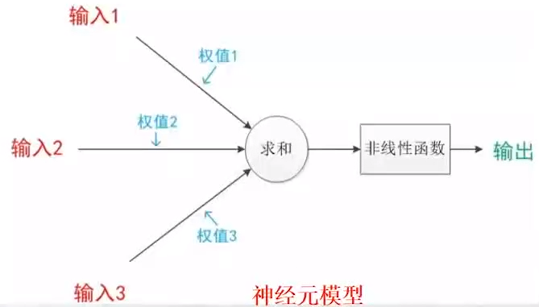
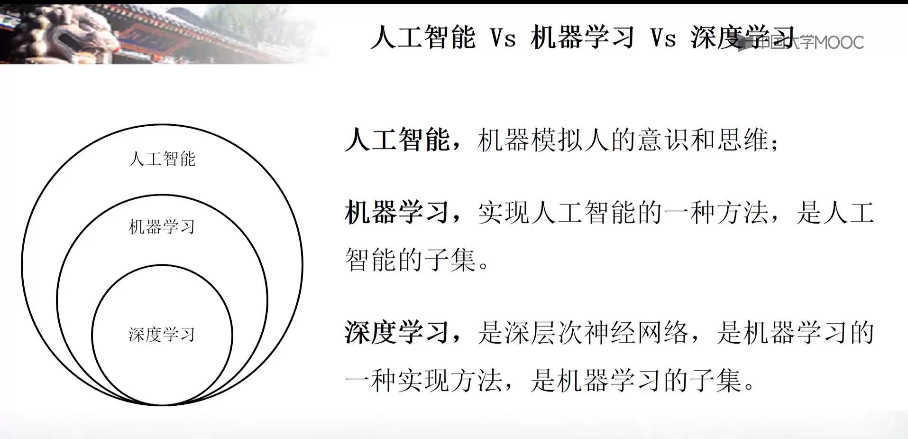
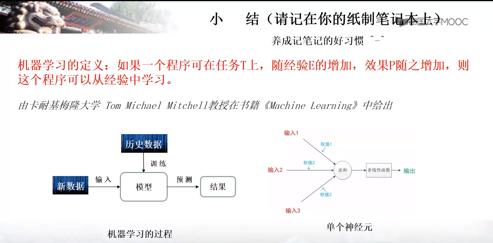

#1.1-概述

阿里巴巴-天猫精灵-自动在淘宝搜索商品-如果身份验证还可以确认账单并付款

小米-小爱同学-米家全系列产品的语音控制

CNN - 计算机视觉领域

RNN - 自然语言处理

决策树模型

机器学习是一种统计学方法，计算机利用已有数据，得出某种模型，再利用此模型预测结果。

随经验增加，其效果越好。

 神经元模型

机器学习的主要应用

对连续数据的预测

对离散数据的分类

计算机视觉、语言识别、自然语言处理

实践项目

1. 完成手写数字识别
2. 完成物体识别

总结

系统环境

Ubuntu 16.04

Python 2.7

Tensorflow 1.3.0

# 1-2-双系统安装

用 UltraISO 制作U盘镜像

压缩磁盘，划分安装分区（100GB左右）

msinfo32

BIOS为UEFI需要关闭安全模式启动（secure boot应为disable）

禁用快速启动(已禁用)

U盘启动

