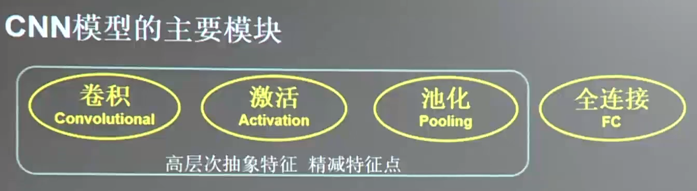

# 7.1 卷积神经网络

全连接 NN:每个神经元与前后相邻层的每一个神经元都有连接关系,输入是特征,输出为预测的结果。
$$
参数个数=\sum(前层\times 后层+后层)
$$
待优化的参数过多，容易导致模型过拟合

在实际应用中,会先对原始图像进行特征提取,把提取到的特征喂给全连接网络,再让全连接网络计算出分类评估值。

卷积是一种有效提取图片特征的方法。一般用一个正方形卷积核，遍历图片上的每一个像素点。图片与卷积核重合区域内相对应的每一个像素值乘卷积核内相对应点的权重，然后求和，再加上偏置后，最后得到输出图片中的一个像素值。
$$
输出图片边长 = (输入图片边长-卷积核长+1)/步长
$$
问题：步长是什么？

答：滑动一次的距离

`tensorflow` 计算卷积：

```python
tf.nn.conv2d(
    # batch给出一次喂入多少组图片; 5,5:分辨率; 1:通道数
	输入图片描述(例：[batch, 5, 5, 1]),
    # 3,3:行,列分辨率; 1:通道数; 16:核个数
    卷积核描述(例：[3, 3, 1, 16]),
    # 中间的两个分别是行步长和列步长; 第一个参数和最后一个参数都固定为1
    核滑动步长(例：[1, 2, 1, 1]),
    padding = 'VALID' # 是否使用 padding
    # padding = 'SAME'
)
```

## 池化(Pooling)

* 池化用于减少特征数量
* `最大值池化`可提取图片纹理，`均值池化`可以保留背景特征。

Tensorflow 计算池化

```python
pool = tf.nn.max_pool( # tf.nn.avg_pool
    # 一次喂入的图片数量, 行、列分辨率, 通道数
    输入描述(例：[batch, 28, 28, 6]),
    # 中间的两个参数为行、列分辨率，第一个参数和最后一个参数都固定为1
    池化核描述(仅大小)(例：[1, 2, 2, 1]),
    # 中间两个参数为行、列步长，第一个参数和最后一个参数都固定为1
    池化核滑动步长(例：[1, 2, 2, 1]),
    padding = 'SAME' # 0填充，不使用填充为 'VALID'
)
```

## 舍弃(Dropout)

* 在神经网络的训练过程中，将一部分神经元按照一定概率从神经网络中暂时舍弃。使用时被舍弃的神经元恢复连接

在实际应用中，常常在前向传播构建神经网络时使用 `Dropout` 来减小过拟合，加快模型的训练速度。


```python
tf.nn.dropout(上层输出, 暂时舍弃的概率)
```

`Dropout` 一般会放在全连接网络中，如果在训练参数的过程中输出

```python
if train: 
    tf.nn.dropout(上层输出, 暂时舍弃的概率)
```


## 卷积神经网络

借助卷积核(kernel)提取特征后，送入全连接网络。




```
发展历史：
Letnet-5 -> AlexNet -> VGGNet -> GoogleNet -> ResNet -> ...
```


# 7.2 lenet5代码讲解

