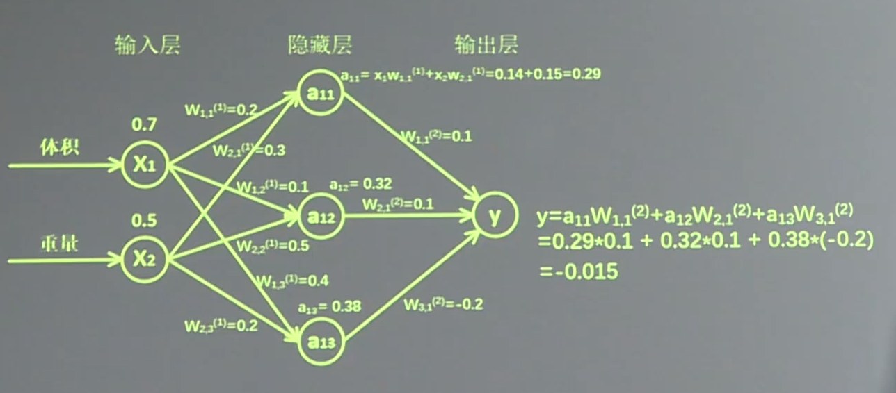

# 3.1 张量、计算图、会话

目标：搭建第一个神经网络，总结搭建八股

基于Tensorflow的NN：用张量表示数据，用计算图搭建神经网络，用会话执行计算图，优化线上的权重（参数），得到模型。

张量(tensor)：多维数组（列表）

阶：张量的维数

| 维数 | 阶   | 名字        | 例子                        |
| ---- | ---- | ----------- | --------------------------- |
| 0-D  | 0    | 标量 scalar | s = 1 2 3                   |
| 1-D  | 1    | 向量 vector | v = [1, 2, 3]               |
| 2-D  | 2    | 矩阵 matrix | m=[[1,2,3],[4,5,6],[7,8,9]] |
| n-D  | n    | 张量 tensor | t=[[[[n个......             |

张量可以表示 0 阶到 n 阶数组（列表）

数据类型： tf.float32 tf.int32 ......

```bash
# vimrc
set ts=4	# tab键为4个空格
set nu		# 显示行号
```

tensorflow加法

```python
import tensorflow as tf # 简写
a = tf.constant([1.0, 2.0])
b = tf.constant([3.0, 4.0])
result = a + b
print result
```

输出

```
Tensor("add:0", shape=(2,), dtype=float32)
         |  |     |    |      |
     节点名  |   维度    |     数据类型
     第0个输出      一维数组长度为2
```


```python
import tensorflow as tf
x = tf.constant([[1.0, 2.0]])
w = tf.constant([[3.0], [4.0]])
y = tf.matmul(x, w)
print y
```


输出

```
Tensor("MatMul:0", shape=(1, 1), dtype=float32)
                      一行一列
```


上述只搭建了计算图，没有运算结果。想要有运算结果就要用到会话。

## 会话

执行计算图中的节点运算

```python
import tensorflow as tf #引入模块
x = tf.constant([[1.0, 2.0]]) #定义一个 2 阶张量等于[[1.0,2.0]]
w = tf.constant([[3.0], [4.0]]) #定义一个 2 阶张量等于[[3.0],[4.0]]
y = tf.matmul(x, w) #实现 xw 矩阵乘法
print y #打印出结果
with tf.Session() as sess:
	print sess.run(y) #执行会话并打印出执行后的结果
```

输出

```
Tensor(“matmul:0”, shape(1,1), dtype=float32)
[[11.]]	
```


```python
tf.Session() # 会话模块，可简写
```

降低tensorflow的提示等级

在 bashrc/zshrc 中加入

```bash
export TF_CPP_MIN_LOG_LEVEL=2
```

# 3.2 前向传播

神经网络的参数：线上的权重W，用变量表示，随机给初值。

```python
w = tf.Variable(tf.random_normal([2, 3], stddev = 2, mean = 0, seed = 1))
#                     |             |      |           |         |
#                  正态分布    产生2x3的矩阵 标准差为2    均值为0   随机种子
tf.truncated_normal() # 去掉过大偏离点的正态分布(两个标准差)
tf.random_uniform()   # 平均分布
tf.zeros # 全0数组 tf.zeros([3, 2], int32)生成[[0, 0], [0, 0], [0, 0]]
tf.ones # 全1数组 tf.ones([3, 2], int32)生成[[1, 1], [1, 1], [1, 1]]
tf.fill # 全定值数组 tf.fill([3, 2], 6)生成[[6, 6], [6, 6], [6, 6]]
tf.constant # 直接给值 tf.constant([3, 2, 1])生成[3, 2, 1]
```

## 神经网络的实现过程

1. 准备数据集，提取特征，作为输入喂给神经网络 (Neural Network, NN)

2. 搭建NN结构，从输入到输出（先打剑计算图，再用会话执行）

    （NN前向传播算法 ---> 计算输出）

3. 大量特征数据喂给NN，迭代优化NN参数

    （NN反向传播算法 ---> 优化参数训练模型）

4. 使用训练好的模型预测和分类

训练过程：步骤1到3的循环迭代

使用过程：步骤4

## 前向传播

搭建模型，实现推理（以全连接网络为例）

例：生产一批零件将体积 $$ x_{1} $$ 和重量 $$ x_{2} $$ 为特征输入NN，通过NN后输出一个数值。



分析：
$$
X是输入为 1\times 2 矩阵；W_{前节点编号，后节点编号^{(层数)}}为待优化参数 \\
W^{(1)} =\begin{bmatrix}
 W_{1,1^{(1)}}&W_{1,2^{(1)}}  &W_{1,3^{(1)}} \\ 
 W_{2,1^{(1)}}&W_{2,2^{(1)}}  &W_{2,3^{(1)}}  
\end{bmatrix} \  \  \  \ 为\ 2\times 3\ 矩阵\\
a^{(1)} = a[a_{11},a_{12},a_{13}]\ 为\ 1\times3\ 矩阵\ = XW^{(1)}\\
W^{(2)} = \begin{bmatrix}
W_{1,1^{(2)}}\\
W_{2,1^{(2)}}\\
W_{3,1^{(2)}}
\end{bmatrix} \ \ \ \ 为\ 3\times 1 \ 矩阵\ \ \ \ y = a^{(1)}W^{(2)}
$$
即

```python
a = tf.matmul(X, W1)
y = tf.matmul(a, W2)
```

代码实现

```python
# 变量初始化、计算图节点的运算过程都要用会话(with结构)实现
with tf.Session as sess:
    sess.run()
# 变量初始化: 在 sess.run 函数中用 tf.global_variables_initializer()
init_op = tf.global_variables_initializer()
sess.run(init_op)
# 计算图节点运算: 在 sess.run 函数中写入待运算的节点
sess.run(y)
# 用 tf.placeholder 占位，在 sess.run 函数中用 feed_dict 喂数据
# 喂一组数据
x = tf.placeholder(tf.float32, shape = (1, 2))
sess.run(y, feed_dict = {x: [[0.5, 0.6]]})
# 喂多组数据
x = tf.placeholder(tf.float32, shape = (None, 2))
sess.run(y, feed_dict = {x: [[0.1, 0.2], [0.2, 0.3], [0.3, 0.4], [0.4, 0.5]]})
# 实践代码 tf3_3.py 感受NN前向传播的过程
```


```python
# tf3_3.py
#coding:utf-8
#两层简单神经网络（全连接）
import tensorflow as tf

#定义输入和参数
x = tf.constant([[0.7, 0.5]])
w1= tf.Variable(tf.random_normal([2, 3], stddev=1, seed=1))
w2= tf.Variable(tf.random_normal([3, 1], stddev=1, seed=1))

#定义前向传播过程
a = tf.matmul(x, w1)
y = tf.matmul(a, w2)

#用会话计算结果
with tf.Session() as sess:
    init_op = tf.global_variables_initializer()
    sess.run(init_op)
    print"y in tf3_3.py is:\n",sess.run(y) 

'''
y in tf3_3.py is : 
[[3.0904665]]
'''

```


# 3.3 反向传播

目标：训练模型参数，在所有参数上用梯度下降，使 NN 模型在训练数据上的损失函数最小。

损失函数(loss): 预测值 (y) 与已知答案 (y_) 的差距

均方误差 MSE: 常用的损失函数之一
$$
MSE(y, y_) = \frac{\sum_{i=1}^{n}(y - y_{\_})^2}{n}
$$

```python
loss = tf.reduce_mean(tf.square(y_ - y))
```

反向传播训练方法：以减小 loss 值为优化目标

```python
# 梯度下降
train_step = tf.train.GradientDescentOptimizer(learning_rate).minimize(loss)
# Momentum 优化器
train_step = tf.train.MomentumOptimizer(learning_rate, momentum).minimize(loss)
# Adam 优化器
train_step = tf.train.AdamOptimizer(learning_rate).minimize(loss)
# 训练时只需选择其中一个就可以了
# 都需要 learning_rate 即学习率这一参数，使用时我们可以先选一个比较小的值填入。e.g 0.001
```

学习率：决定参数每次更新的幅度


tf3_6.py

初值：

```
X:
[[0.83494319 0.11482951]
 [0.66899751 0.46594987]
 [0.60181666 0.58838408]
 [0.31836656 0.20502072]
 [0.87043944 0.02679395]
 [0.41539811 0.43938369]
 [0.68635684 0.24833404]
 [0.97315228 0.68541849]
 [0.03081617 0.89479913]
 [0.24665715 0.28584862]
 [0.31375667 0.47718349]
 [0.56689254 0.77079148]
 [0.7321604  0.35828963]
 [0.15724842 0.94294584]
 [0.34933722 0.84634483]
 [0.50304053 0.81299619]
 [0.23869886 0.9895604 ]
 [0.4636501  0.32531094]
 [0.36510487 0.97365522]
 [0.73350238 0.83833013]
 [0.61810158 0.12580353]
 [0.59274817 0.18779828]
 [0.87150299 0.34679501]
 [0.25883219 0.50002932]
 [0.75690948 0.83429824]
 [0.29316649 0.05646578]
 [0.10409134 0.88235166]
 [0.06727785 0.57784761]
 [0.38492705 0.48384792]
 [0.69234428 0.19687348]
 [0.42783492 0.73416985]
 [0.09696069 0.04883936]]
Y_:
[[1], [0], [0], [1], [1], [1], [1], [0], [1], [1], [1], [0], [0], [0], [0], [0], [0], [1], [0], [0], [1], [1], [0], [1], [0], [1], [1], [1], [1], [1], [0], [1]]
w1:
[[-0.8113182   1.4845988   0.06532937]
 [-2.4427042   0.0992484   0.5912243 ]]
w2:
[[-0.8113182 ]
 [ 1.4845988 ]
 [ 0.06532937]]

```

3k轮：

```
After 0 training step(s), loss_mse on all data is 5.13118
After 500 training step(s), loss_mse on all data is 0.429111
After 1000 training step(s), loss_mse on all data is 0.409789
After 1500 training step(s), loss_mse on all data is 0.399923
After 2000 training step(s), loss_mse on all data is 0.394146
After 2500 training step(s), loss_mse on all data is 0.390597


w1:
[[-0.7000663   0.91363174  0.0895357 ]
 [-2.3402493  -0.14641264  0.58823055]]
w2:
[[-0.06024268]
 [ 0.91956186]
 [-0.06820709]]
```


4k轮：

```
After 0 training step(s), loss_mse on all data is 5.13118
After 500 training step(s), loss_mse on all data is 0.429111
After 1000 training step(s), loss_mse on all data is 0.409789
After 1500 training step(s), loss_mse on all data is 0.399923
After 2000 training step(s), loss_mse on all data is 0.394146
After 2500 training step(s), loss_mse on all data is 0.390597
After 3000 training step(s), loss_mse on all data is 0.388336
After 3500 training step(s), loss_mse on all data is 0.386855


w1:
[[-0.6977759  0.8817218  0.0918534]
 [-2.341148  -0.1334021  0.5872761]]
w2:
[[-0.06928983]
 [ 0.88579935]
 [-0.06293624]]
```

8k轮：

```
After 0 training step(s), loss_mse on all data is 5.13118
After 500 training step(s), loss_mse on all data is 0.429111
After 1000 training step(s), loss_mse on all data is 0.409789
After 1500 training step(s), loss_mse on all data is 0.399923
After 2000 training step(s), loss_mse on all data is 0.394146
After 2500 training step(s), loss_mse on all data is 0.390597
After 3000 training step(s), loss_mse on all data is 0.388336
After 3500 training step(s), loss_mse on all data is 0.386855
After 4000 training step(s), loss_mse on all data is 0.385863
After 4500 training step(s), loss_mse on all data is 0.385186
After 5000 training step(s), loss_mse on all data is 0.384719
After 5500 training step(s), loss_mse on all data is 0.384391
After 6000 training step(s), loss_mse on all data is 0.38416
After 6500 training step(s), loss_mse on all data is 0.383995
After 7000 training step(s), loss_mse on all data is 0.383877
After 7500 training step(s), loss_mse on all data is 0.383791


w1:
[[-0.69272923  0.8258722   0.09565482]
 [-2.3430123  -0.1112787   0.58573544]]
w2:
[[-0.08448368]
 [ 0.826912  ]
 [-0.05388713]]
```

更改为 Momentum 优化器：

```
After 0 training step(s), loss_mse on all data is 5.13118
After 500 training step(s), loss_mse on all data is 0.384391
After 1000 training step(s), loss_mse on all data is 0.383592
After 1500 training step(s), loss_mse on all data is 0.383562
After 2000 training step(s), loss_mse on all data is 0.383561
After 2500 training step(s), loss_mse on all data is 0.383561
After 3000 training step(s), loss_mse on all data is 0.383561
After 3500 training step(s), loss_mse on all data is 0.383561
After 4000 training step(s), loss_mse on all data is 0.383561
After 4500 training step(s), loss_mse on all data is 0.383561
After 5000 training step(s), loss_mse on all data is 0.383561
After 5500 training step(s), loss_mse on all data is 0.383561
After 6000 training step(s), loss_mse on all data is 0.383561
After 6500 training step(s), loss_mse on all data is 0.383561
After 7000 training step(s), loss_mse on all data is 0.383561
After 7500 training step(s), loss_mse on all data is 0.383561


w1:
[[-0.612804    0.83138     0.07551862]
 [-2.2565794  -0.14494489  0.5676084 ]]
w2:
[[-0.1044089]
 [ 0.7733265]
 [-0.044155 ]]
```

更改为 Adam 优化器：

```
After 0 training step(s), loss_mse on all data is 5.20999
After 500 training step(s), loss_mse on all data is 0.617026
After 1000 training step(s), loss_mse on all data is 0.392288
After 1500 training step(s), loss_mse on all data is 0.386432
After 2000 training step(s), loss_mse on all data is 0.384254
After 2500 training step(s), loss_mse on all data is 0.383676
After 3000 training step(s), loss_mse on all data is 0.383573
After 3500 training step(s), loss_mse on all data is 0.383561
After 4000 training step(s), loss_mse on all data is 0.383561
After 4500 training step(s), loss_mse on all data is 0.383561
After 5000 training step(s), loss_mse on all data is 0.383561
After 5500 training step(s), loss_mse on all data is 0.383561
After 6000 training step(s), loss_mse on all data is 0.383561
After 6500 training step(s), loss_mse on all data is 0.383561
After 7000 training step(s), loss_mse on all data is 0.383561
After 7500 training step(s), loss_mse on all data is 0.383561


w1:
[[-0.39867923  1.020235    1.0064621 ]
 [-2.132083   -0.2381399   1.1238164 ]]
w2:
[[-0.4468922 ]
 [ 1.0463178 ]
 [-0.53858715]]
```

更改 BATCH_SIZE 可能影响loss吗？ 不影响

## 搭建神经网络的八股：准备、前传、反转、迭代

### 0 准备

import

常量定义

生成数据集

### 1 前向传播：定义输入、参数和输出

```python
x = 
y_ =   # 标准答案y

w1 =   # 第一层参数 w1
w2 =   # 第二层参数 w2
# 推理过程，用矩阵乘法求出 y
a =    
y = 
```

### 2 反向传播：定义损失函数、反向传播方法

```
loss = 
train_step = 
```

### 3 生成会话，训练STEPS轮

```python
# 完成迭代
with tf.Session() as sess:
    # 初始化所有参数
    init_op = tf.global_variables_initializer()
    sess_run(init_op)
    # 定义循环轮数
    STEPS = 300
    for i in range(STEPS):
        # 每次循环喂入 batch 个输入特征和标准答案
        start = 
        end = 
        # 对反向传播过程进行运算
        sess.run(train_step, feed_dic)
        # 常用print提示轮数
```

