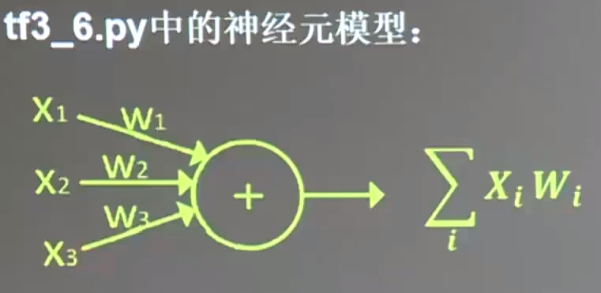
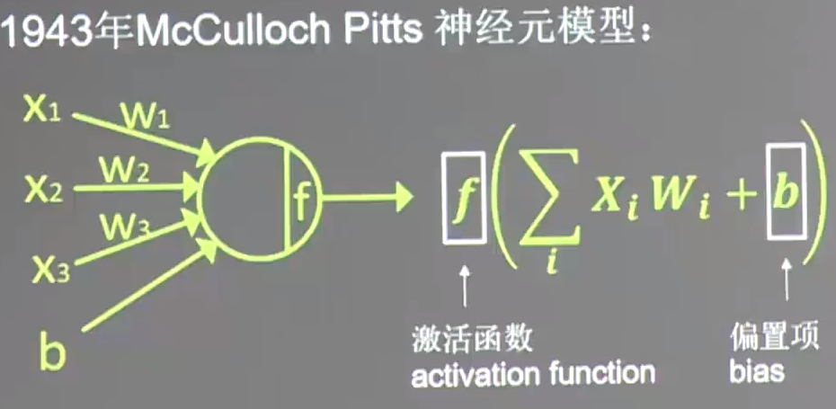
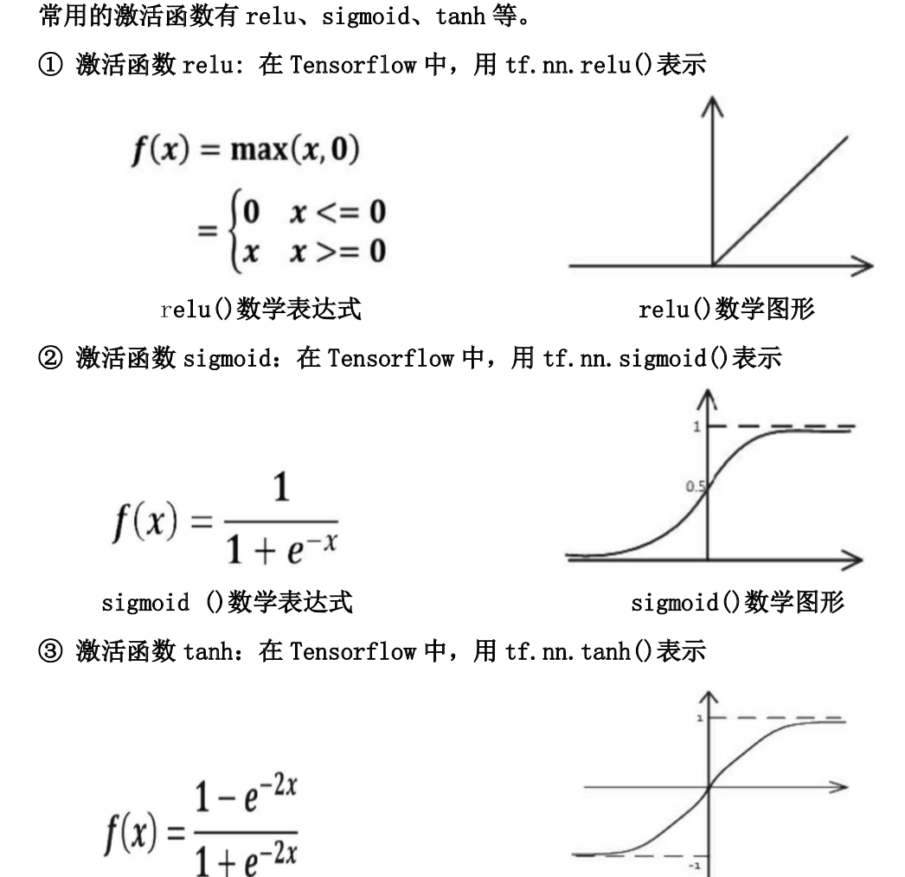

# 4.1 损失函数





引入的激活函数 $$f$$ 可以有效避免仅使用 $$\sum X_{i}W_{i} $$ 的纯线性组合，提高了模型的表达力，使模型具有更好的区分度。

常用的激活函数：



NN复杂度： NN层数和NN参数的个数

## 神经网络的优化

四方面：损失函数loss、学习率learning_rate、滑动平均ema、正则化regularization

### 损失函数(loss) ：预测值(y)与已知答案(y_)的差距

```
                      /--  mse (Mean Squared Error) 均方误差
NN优化目标： loss最小  <---- 自定义
                      \--  ce (Cross Entropy) 交叉熵
```

#### 均方误差 mse

运行 `opt4_1.py` 代码，发现梯度下降优化方法收敛速度慢，20000次还没有完全收敛。

使用 `Momentum优化器` 优化，过了6500轮就收敛了。

而 `Adam优化器` 的效果也比较不错

#### 自定义损失函数

 实现方法

```python
loss = tf.reduce_sum(tf.where(tf.greater(y,y_),COST(y-y_),PROFIT(y_-y)))
# tf.greater(y, y_), COST(y - y_), PROFIT(y_ - y)
# y > y_ ? COST(y - y_) : PROFIT(y_ - y)
```

### 交叉熵 ce(Cross Entropy)

表征两个概率分布之间的距离

```python
ce = -tf.reduce_mean(y_ * tf.log(tf.clip_by_value(y, 1e-12, 1.0)))
# tf.clip_by_value(y, 1e-12, 1.0)
# y 小于 1e-12 为 1e-12， 大于 1.0 为 1.0
```

```python
ce = tf.nn.sparse_softmax_cross_entropy_with_logits(logits=y, labels=tf.argmax(y_, 1))
cem = tf.reduce_mean(ce)
# 输出为当前计算出的预测值与标准答案的差距，即损失函数
```

