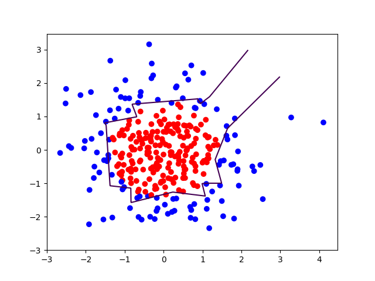
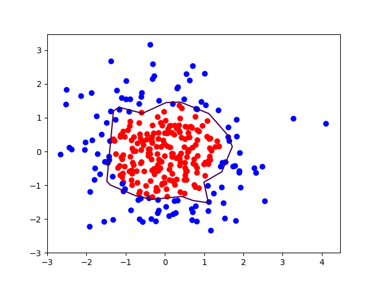

# 4.1 损失函数


引入的激活函数 $$f$$ 可以有效避免仅使用 
$$
\sum X_{i}W_{i}
$$


的纯线性组合，提高了模型的表达力，使模型具有更好的区分度。

常用的激活函数：


NN复杂度： NN层数和NN参数的个数

## 神经网络的优化

四方面：损失函数loss、学习率learning_rate、滑动平均ema、正则化regularization

### 损失函数(loss) ：预测值(y)与已知答案(y_)的差距

```
                      /--  mse (Mean Squared Error) 均方误差
NN优化目标： loss最小  <---- 自定义
                      \--  ce (Cross Entropy) 交叉熵
```

#### 均方误差 mse

运行 `opt4_1.py` 代码，发现梯度下降优化方法收敛速度慢，20000次还没有完全收敛。

使用 `Momentum优化器` 优化，过了6500轮就收敛了。

而 `Adam优化器` 的效果也比较不错

#### 自定义损失函数

 实现方法

```python
loss = tf.reduce_sum(tf.where(tf.greater(y,y_),COST(y-y_),PROFIT(y_-y)))
# tf.greater(y, y_), COST(y - y_), PROFIT(y_ - y)
# y > y_ ? COST(y - y_) : PROFIT(y_ - y)
```

### 交叉熵 ce(Cross Entropy)

表征两个概率分布之间的距离

```python
ce = -tf.reduce_mean(y_ * tf.log(tf.clip_by_value(y, 1e-12, 1.0)))
# tf.clip_by_value(y, 1e-12, 1.0)
# y 小于 1e-12 为 1e-12， 大于 1.0 为 1.0
```

```python
ce = tf.nn.sparse_softmax_cross_entropy_with_logits(logits=y, labels=tf.argmax(y_, 1))
cem = tf.reduce_mean(ce)
# 输出为当前计算出的预测值与标准答案的差距，即损失函数
```

# 4.2 学习率 learning rate

参数每次更新的幅度
$$
w_{n-1}=w_{n}- \ learning\_rate\bigtriangledown
$$
其中
$$
w_{n+1}为更新后的参数\\
w_{n} 为当前参数\\
learnng_rate 为学习率\\
\bigtriangledown 为损失函数的梯度(导数)\\
即参数更新向着损失函数梯度下降的方向
$$

## 学习率设置多少合适？

学习率大了不收敛，学习率小了收敛速度慢

### 指数衰减学习率

根据运行 `BATCH_SIZE` 的轮数动态更新学习率
$$
learning\_rate = LEARNING\_RATE\_BASE*LEARNING\_RATE\_DECAY^{\frac{global\_step}{LEARNING\_RATE\_STEP}}\\
LEARNING\_RATE\_BASE : \ \ 学习率基数，学习率初始值\\
LEARNING\_RATE\_DECAY : \ \ 学习率衰减率(0,\ 1)\\
global\_step : \ \ 运行了几轮 BATCH\_SIZE\\
LEARNING\_RATE\_STEP : \ \ 多少轮更新一次学习率 = 总样本数 / BATCH\_SIZE
$$


```python
# 首先定义一个 global_step 作为计数器记录当前共运行了多少轮 BATCH_SIZE 个数据
global_step = tf.Variable(0, trainable = False)
# 由于这个变量只用于计数，并非训练的参数，因此我们标注它为不可训练

learning_rate = tf.train.exponentual_decay(
	LEARNING_RATE_BASE, # 学习率基数, 最初的学习率, 超参数
	global_step, # 当前运行到第几轮的计数器
	LEARNING_RATE_STEP, # 学习率多少轮更新一次
	LEARNING_RATE_DECAY,
	staircase = True) 
# staircase 为 True 时 global_step / LEARNING_RATE_STEP 取整数，学习率阶梯型衰减
#           为 False 时则为一条平滑下降的曲线
```


# 4.3 滑动平均(影子值)

记录了每个参数一段时间内过往值的平均，由于滑动平均值不仅表现了当前值，还表示了过去一段时间内的平均值，这样增加了模型的泛化性。

滑动平均通常针对所有参数进行优化，包括所有的w和b
$$
影子 = 衰减率 \times 影子 +(1 - 衰减率) \times 参数\ \ \ \ \ \ \ \ 影子初值=参数初值 \\
衰减率=min\{ MOVING\_ AVERAGE\_DECAY, \ \frac{1+轮数}{10+轮数} \}
$$
衰减率的第一个参数 `MOVING_AVERAGE_DECAY ` 是一个超参数，一般会赋一个比较大的值如 0.99

 参数 `w1` 在初始化时赋值为0，轮数 `global_step` 定义为 0。

在 `tensorflow` 中用这三句话描述滑动平均：

```python
ema = tf.train.ExponentialMovingAverage(
	MOVING_AVERAGE_DECAY, # 衰减率：超参数，一般会给比较大的值
	global_step) # 当前轮数
# ema_op = ema.apply([]) 定义了对括号内的参数求滑动平均
ema_op = ema.apply(tf.trainable_variables()) # 每运行此句，所有待优化参数求滑动平均
# tf.trainable_variables() 这个函数可以自动将待训练的参数汇总成列表

# 在工程应用中，我们常把计算滑动平均和训练过程绑定在一起运行，他们合成一个训练节点，用下述语句实现：
with  tf.contrtrol_dependenciew([train_step, ema_op]):
    train_op = tf.no_op(name = 'train')

# 在下节课的手写数字识别中会用到以下功能：
# ema.average(参数名) 可以返回某些参数的滑动平均值。
```

# 4.4 正则化

正则化缓解过拟合

正则化在损失函数中引入模型复杂度指标，利用给 W 加权值，弱化了训练数据的噪声 (一般不正则化b)
$$
loss = loss(y与y\_)+ REGULARIZER*loss(w)
$$
`loss` 指模型中所有参数的损失函数如：交叉熵、均方误差

`REGULARIZER` 用超参数 `REGULARIZER` 给出参数 `w` 在总 `loss` 中的比例，即正则化的权重

`loss(w)` 中的 `w` ： 需要正则化的参数

loss(w) 有两种计算方法

1. 第一种是对所有参数 `w` 的绝对值求和，叫做 `L1` 正则化

$$
loss_{L1}(w) = \sum_{i}|w_{i}|
$$

```python
loss(w) = tf.contrib.layers.l1_regularizer(REGULARIZER)(w)
```


2. 第二种是对所有参数 `w` 平方求和，叫做 `L2` 正则化

$$
loss_{L2}(w)=\sum_{i}|w_{i}^{2}|
$$

```
loss(w) = tf.contrib.layers.l2_regularizer(REGULARIZER)(w)
```

使用时选择一种即可。

```python
# 将计算好的所有 w 正则化加在 losses 集合中
tf.add_to_collection('losses', tf.contrib.layers.l2_regularizer(regularizer)(w))

# 将 losses 里的所有值相加再加上交叉熵构成总损失函数
loss = cem + tf.add_n(tf.get_collection('losses'))
```


生成一套数据集，随机产生 300 个符合正态分布的点 `X[x0, x1]`

当 $$x_{0}^{2} + x_{1}^{2} <2$$ 时标注 y_=1 为红色，其余的标注为 y_=0(蓝色)

尝试拟合一条曲线将红色的点和蓝色的点分开

使用新模块 `matplotlib`

```python
import matplotlib.pyplot as plt
# plt.scatter(x坐标, y坐标, c = "颜色") 可视化这些数据点
# plt.show() # 将图像散点画出来
# 形成坐标点
# xx, yy = np.mgrid[起 : 止 : 步长, 起 : 止 : 步长]
# 降低维度(拉直)
# grid = np.c_[xx.ravel(), yy.ravel()]
#       组成矩阵          拉直
# 上述代码最终收集到了这个区域内所有的网格坐标点。
# 我们将所有收集起来的这些网格坐标点喂入神经网络，经网络计算推测得到结果 y ，赋值给 probs ，即 区域中所有坐标点偏红还是偏蓝的量化值。
probs = sess.run(y, feed_dict = {x : grid})
# 将 probs 整形，让它的形状和 xx 的形状一样
probs = probs.reshape(xx.shape)
# 告知相关信息
# plt.contour(x轴坐标值, y轴坐标值, 该点的高度, levels = [等高线的高度])
# 画出相关点
plt.show()
```

我跑的 `opt4_7.py` 的结果：

无正则化：



带正则化：



从刚才的可视化效果中可以看出，包含了正则化的分割线会更平滑，数据集中的噪声对模型的影响更小。

# 4.5 神经网络搭建八股

模块化的设计思想

前向传播就是搭建网络，设计网络结构 (`forward.py`)

描述中定义三个函数

```python
# 完成网络结构的设计，给出输入到输出的数据通路
# 定义时注意有两个参数，第一个是输入 x 另一个是正则化权重。
def forward(x, regularizer):
    # 定义前向传播过程
    w = 
    b = 
    y = 
    return y
# 第二个函数与参数 w 有关，该函数包括两个参数，其一为形状 shape ，第二个是正则化权重
def get_weight(shape, regularizer):
    # 该函数需要给 w 赋初值
    w = tf.Variable() # 括号中为赋初值的方法(3.2节中)
    # 把每一个 w 的正则化损失加到总损失 losses 中
    tf.add_to_collection("losses", tf.contrib.layers.l2_regularizer(regularizer(w)))
    return w
# 第三个函数与参数 b 有关，它的参数是 b 的形状即某层中 b 的个数
def get_bias(shape):
    # 该函数需要给 b 赋初值
    b = tf.Variable() # 括号中为赋初值的方法(3.2节中)
    return b
```


反向传播就是训练网络，优化网络参数 (`backward.py`)

```python
def backward():
    # 首先用 placeholder 给输入 x 和 y_ 占位
    x = tf.placeholder( )
    y_ = tf.placeholder( )
    # 利用 forward 模块复现前向传播设计的网络结构计算求得 y
    y = forward.forward(x, REGULARIZER)
    # 定义轮数计数器 global_step
    global_step = tf.Variable(0, trainable = False)
    # 定义损失函数 loss
    loss = 
    '''
    loss 可以是
    均方差 
    loss_mse = tf.reduce_mean(tf.square(y - y_))
    自定义
    交叉熵
    ce = tf.nn.sparse_softmax_cross_entropy_with_logits(logits = y, labels = tf.argmax(y_, 1))
    loss_cem = tf.reduce_mean(ce)
    
    加入正则化后
    loss = loss_pre + tf.add_n(tf.get_collection("losses"))
           之前的loss             所有 w 的正则化
    '''
    # 如果使用指数衰减学习率，下述代码可以动态计算学习率。
    learning_rate = tf.train.exponential_decay(
    	LEARNING_RATE_BASE, 
    	global_step,
    	数据集总样本数/BATCH_SIZE,
    	LEARNING_RATE_DECAY,
    	staircase = True)
    # 反向传播函数还要定义训练过程 train_step
    train_step = tf.GradientDescentOptimizer(learning_rate).minimize(loss, global_step = global_step)
    # 用滑动平均需要加上下述代码，其 global_step 是和指数衰减学习率共用的。
    ema = tf.train.ExponentialMovingAverage(MOVINNG_AVERAGE_DECAY, global_step)
    ema_op = ema.apply(tf.trainable_variables())
    with tf.control_dependencies([train_step, ema_op]):
        train_op = tf.no_op(name = 'train')
    # 用 with 结构初始化所有参数
    with tf.Session() as sess:
        init_op = tf.global_variables_initializer()
        sess.run(init_op)
        # 用 for 循环迭代 STEPS 轮
        for i in range(STEPS):
            # 每轮调用 sess.run 执行训练过程
            sess.run(train_step, feed_dict = {x : , y_ : })
            # 每运行一段轮数打印当前的 loss 信息
            if i % 轮数 == 0:
                print 

if __name__ == '__main__':
    backward()
```

